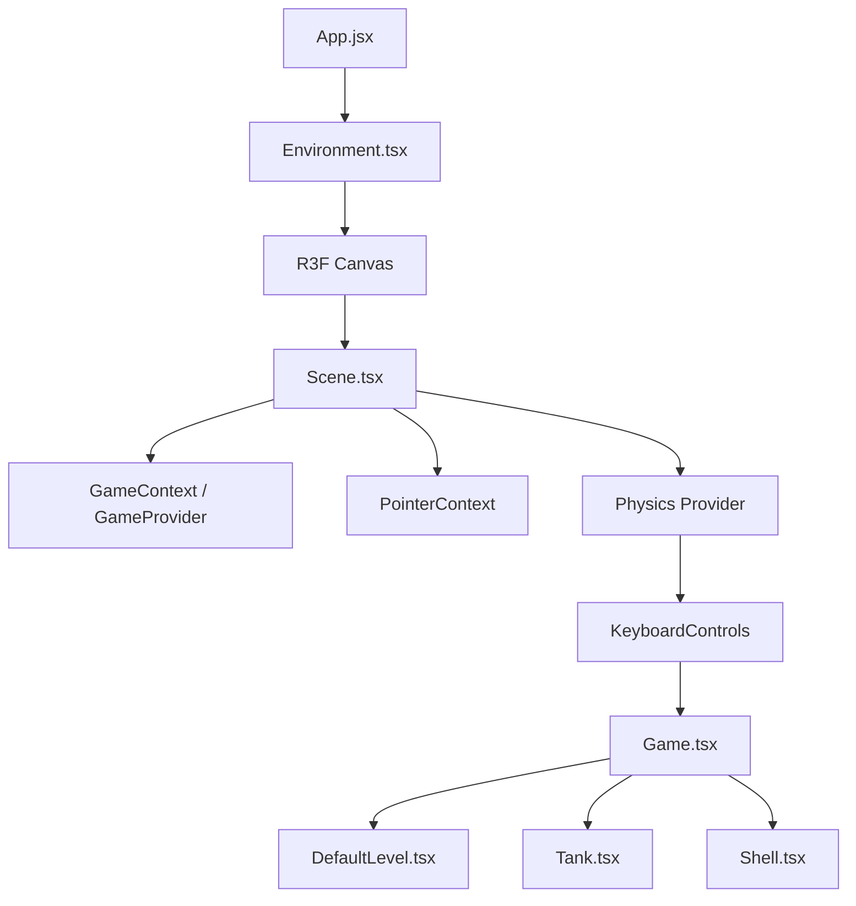

# Tank Game Development Guidelines

This document describes the general architecture, state management, and physics integration for the 3D Tank Game project.

---

## 🏗️ Architecture & General Structure

The application is structured as a React Three Fiber (R3F) application integrated with a 2D physics engine (`p2.js`) simulated via web workers.



### File Hierarchy & Roles:
- **Entry & Shell**:
  - [App.jsx](file:///c:/Users/morit/vscode_repos/tank_game/src/App.jsx): Entry point component.
  - [Environment.tsx](file:///c:/Users/morit/vscode_repos/tank_game/src/3d/Environment.tsx): Setup for the Drei Canvas, debug panels (Leva), and camera properties.
- **Scene Coordination**:
  - [Scene.tsx](file:///c:/Users/morit/vscode_repos/tank_game/src/3d/Scene.tsx): Defines lighting, grid helpers, the physics simulation context (`Physics`), keyboard bindings, and context providers.
  - [Game.tsx](file:///c:/Users/morit/vscode_repos/tank_game/src/3d/Game.tsx): The gameplay coordinator that maps active entity state to React components.
- **State & Context**:
  - [GameContext.tsx](file:///c:/Users/morit/vscode_repos/tank_game/src/3d/context/GameContext.tsx): Manages the state of active tanks, shells, game loop control (play/pause), and level settings. Exposes callback helpers like `spawnShell`, `removeShell`, `addTank`, and `removeTank`.
  - [PointerContext.tsx](file:///c:/Users/morit/vscode_repos/tank_game/src/3d/context/PointerContext.tsx): Tracks the 3D pointer position on the game plane to aim the player's turret.
- **Entities**:
  - [tank.tsx](file:///c:/Users/morit/vscode_repos/tank_game/src/3d/entities/tank.tsx): Tank component handling keyboard input, physics forces, and turret aiming.
  - [shell.tsx](file:///c:/Users/morit/vscode_repos/tank_game/src/3d/entities/shell.tsx): Projectile component handling kinematic movement and lifetime.
- **Level**:
  - [DefaultLevel.tsx](file:///c:/Users/morit/vscode_repos/tank_game/src/3d/level/DefaultLevel.tsx): Renders the level walls.
  - [LevelWall.tsx](file:///c:/Users/morit/vscode_repos/tank_game/src/3d/level/components/LevelWall.tsx): Individual static wall component with a rigid physics body.

---

## ⚙️ Physics Integration (`@react-three/p2`)

The game uses `p2.js` for 2D rigid body simulation, mapped onto a 3D R3F scene.

### Coordinate Mapping
*   The physics plane is configured in [Scene.tsx](file:///c:/Users/morit/vscode_repos/tank_game/src/3d/Scene.tsx) using `normalIndex={1}`.
*   This designates the **Y-axis** as the normal vector, meaning coordinates map as:
    *   Physics Engine `[x, y]` $\rightarrow$ 3D Scene `[x, z]`
*   All positions passed to physics bodies or entities must be 2D coordinates representing the horizontal plane.

### Instantiating Physics Bodies
To prevent physics bodies from being recreated on every component render, physics hooks (like `useBox`) must be initialized with a stable dependency array.

*   **Hook Signature**:
    ```typescript
    useBox(fn, fwdRef, deps)
    ```
*   **Standard Implementation**:
    ```typescript
    const [ref, api] = useBox(() => ({
      mass: 10,
      position: [position[0], position[1]],
      args: [width, depth],
      // additional physics properties...
    }), null, []);
    ```
    *Note: Always pass `null` for `fwdRef` and an empty array `[]` (or appropriate dependencies) as the third argument to keep the physics body registry persistent.*

---

## 🚀 Development Workflow & Scripts
- Local development: `npm run dev`
- Build production bundle: `npm run build`
- Preview build: `npm run preview`
